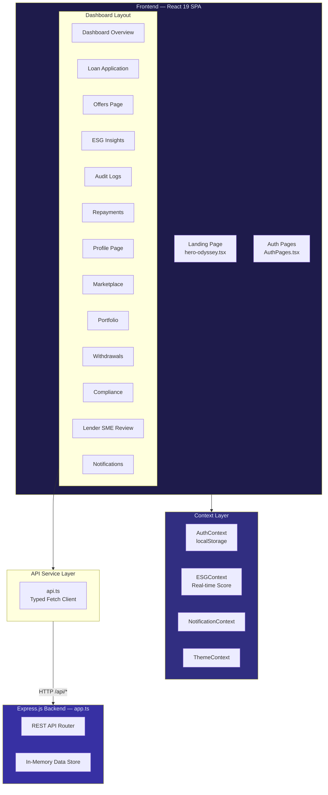
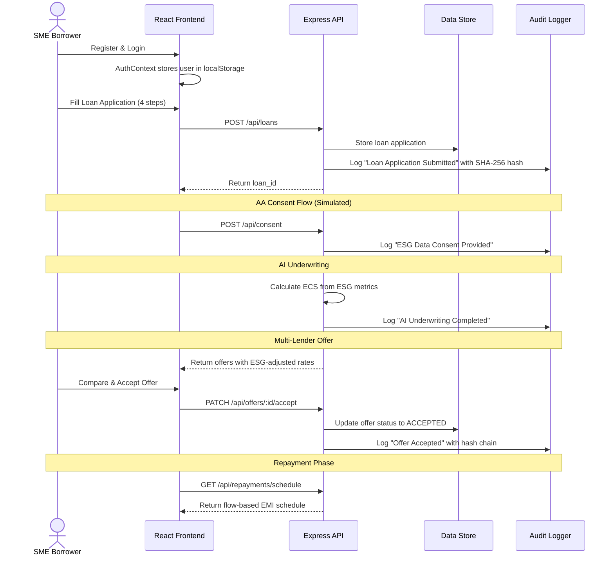
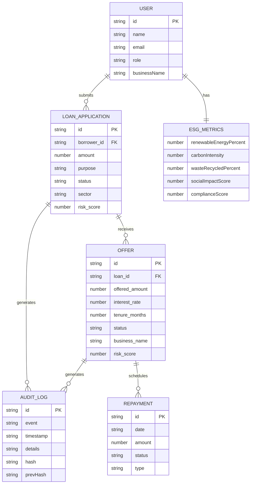
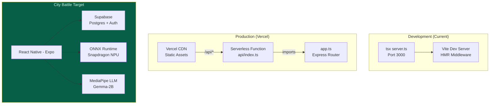

# JustThryve — On-Device AI Green Lending for India's MSMEs

> **Making ESG-positive SMEs creditworthy by design — phone-first, privacy-first, flow-based.**

[](https://react.dev)
[](https://www.typescriptlang.org/)
[](https://tailwindcss.com/)
[](https://expressjs.com/)
[](https://vitejs.dev/)
[](https://recharts.org/)
[](https://opensource.org/licenses/MIT)
[](https://iqoo.reskilll.com)
[]()

---

## 📑 Table of Contents

- [Overview](#overview)
- [Problem Statement](#problem-statement)
- [Solution & Key Features](#solution--key-features)
- [User Personas](#user-personas)
- [Business Opportunity](#business-opportunity)
- [Relevance to the Hackathon](#relevance-to-the-hackathon)
- [Architecture & System Design](#architecture--system-design)
- [Tech Stack](#tech-stack)
- [Getting Started](#getting-started)
- [Project Structure](#project-structure)
- [Key Implementation Details](#key-implementation-details)
- [Screenshots / Demo](#screenshots--demo)
- [Future Improvements & Roadmap](#future-improvements--roadmap)
- [Contributing Guidelines](#contributing-guidelines)
- [License](#license)
- [Team / Credits](#team--credits)
- [Contact / Links](#contact--links)

---

## Overview

**JustThryve** is an OCEN-native, ESG-linked green lending platform purpose-built for India's underserved Micro, Small, and Medium Enterprises (MSMEs). It reimagines credit underwriting by treating Environmental, Social, and Governance (ESG) metrics — renewable energy usage, carbon intensity, waste recycling rates — as first-class credit signals rather than compliance checkboxes.

The platform connects **SME borrowers** seeking collateral-free green credit with **institutional lenders** looking for ESG-positive investment opportunities, all through a unified dashboard. Credit decisions are made transparent via SHAP-style explainability, repayment amounts dynamically scale with the borrower's GST revenue (flow-based EMI), and every transaction is logged on a tamper-evident SHA-256 hash chain for anti-greenwashing assurance.

JustThryve is built as a full-stack TypeScript application using React 19, Tailwind CSS 4, Recharts, and Framer Motion on the frontend, with an Express.js API backend. The current prototype simulates the complete OCEN lending lifecycle — from borrower onboarding and AA consent to multi-lender offer comparison, dynamic EMI calculation, and immutable audit logging — providing a functional, demo-ready vertical slice of the entire platform.

For the **iQOO Hackathon 2026 Chennai City Battle**, we are evolving this into a **phone-first, on-device AI** application leveraging the Snapdragon NPU for local credit scoring and a privacy-first financial advisor, ensuring sensitive financial data never leaves the user's device.

---

## Problem Statement

India has **6.3 crore MSMEs**, yet access to formal credit remains a critical bottleneck — especially for the growing segment of green and sustainable businesses.

### Why Traditional Lending Fails Green SMEs

| Friction Point | Impact |
|:---|:---|
| **Collateral-Based Underwriting** | Banks demand 130–150% LTV. EV/solar/organic SMEs hold mostly intangible assets and have no property to pledge. |
| **New-To-Credit (NTC) Exclusion** | 78% of green MSMEs lack any credit history. Without a 6-month credit footprint, they are invisible to traditional scoring. |
| **Cash-Flow Mismatch** | Government subsidies (e.g., FAME-III for EV) lag by 45–90 days, distorting repayment schedules and triggering defaults on rigid EMIs. |
| **ESG Data is Siloed** | Sustainability metrics (energy mix, carbon data, compliance certifications) exist but are not connected to credit decisioning. |

**Result:** ₹3.2 Lakh Crore of unmet credit demand among India's EV and green SME segment alone. These businesses contribute to India's net-zero goals but are systematically denied affordable capital.

---

## Solution & Key Features

JustThryve bridges this gap by building an **OCEN-native Loan Service Provider (LSP)** that uses alternative data — GST revenue, renewable energy consumption, carbon intensity, compliance records — to underwrite green SMEs without collateral.

### Core Features

| # | Feature | Description | Implementation |
|:--|:---|:---|:---|
| 1 | **Dual-Role Dashboard** | Separate interfaces for Borrowers and Lenders with role-based route guards (`ProtectedRoute`, `LenderGuard` in `App.tsx`) | `DashboardOverview.tsx` — 30KB, richest page |
| 2 | **ESG Credit Scoring** | Composite ESG Credit Score (ECS, 0–1000) incorporating renewable energy %, carbon intensity, waste recycling, social impact, and compliance scores | `ESGContext.tsx` + `ESGInsights.tsx` |
| 3 | **Multi-Step Loan Application** | 4-step guided application: Business Details → Financial Info → ESG Data → Review & Submit | `LoanApplication.tsx` — 23KB |
| 4 | **Multi-Lender Offer Comparison** | Borrowers compare offers from multiple lenders side-by-side, with ESG-adjusted interest rates | `OffersPage.tsx` — 20KB |
| 5 | **Flow-Based Dynamic EMI** | `EMI = 15% × Avg. GST Revenue (Last 3 Months)`. Automatically scales up in boom months and down during subsidy lags. | Revenue-linked formula in `DashboardOverview.tsx` |
| 6 | **ESG-Linked Interest Rates** | ECS ≥ 800: −1.5% rate discount. ECS 600–800: standard rate. ECS < 600: +1.0% risk premium. | Rate adjustment logic in offer system |
| 7 | **Immutable Audit Ledger** | SHA-256 hash chain linking every event (application, consent, disbursement, ESG update) for tamper-evident anti-greenwashing. | `AuditLogs.tsx` + hash generation in `app.ts` |
| 8 | **Lender SME Review** | Lenders browse and evaluate SME applications by sector, ESG score, and risk grade | `LenderSMEReview.tsx` |
| 9 | **Portfolio Analytics** | Sector distribution (pie chart), total returns, average ESG score for lender portfolios | `PortfolioPage.tsx` |
| 10 | **Compliance Verification** | Automated RBI regulatory compliance checks (KFS, cooling-off period, XAI) | `ComplianceVerification.tsx` |
| 11 | **Loan Marketplace** | Discover and browse available loan products across lenders | `MarketplacePage.tsx` — 13KB |
| 12 | **Real-Time ESG Fluctuation** | ESG scores update every 15 seconds simulating live IoT/smart meter data feeds | `ESGContext.tsx` — `setInterval` at 15s |
| 13 | **WebGL Aurora Hero** | Premium animated landing page with OGL-powered aurora background and Framer Motion transitions | `hero-odyssey.tsx` — 20KB |
| 14 | **Dark/Light Theme** | System-wide theme toggle with CSS custom properties | `ThemeContext.tsx` |
| 15 | **In-App Notifications** | Context-driven notification center with read/unread state | `NotificationContext.tsx` + `NotificationsPage.tsx` |

---

## User Personas

### 👤 Ravi Krishnan, 34 — EV Fleet Operator, Coimbatore

| Attribute | Detail |
|:---|:---|
| **Background** | Runs a fleet of 12 electric delivery vehicles in Coimbatore, serving last-mile logistics for e-commerce. 2 years in business, ₹18L annual revenue. |
| **Pain Point** | Rejected by 3 banks — no collateral (vehicles are leased), no credit history (NTC), and FAME-III subsidy delays make his cash flow look unstable. |
| **Goal** | Secure a ₹10L working capital loan to expand to 20 vehicles. Willing to share ESG data to prove operational sustainability. |
| **How JustThryve Helps** | His 100% renewable energy usage and zero-emission fleet translate to an ECS of 870, earning him a 1.5% rate discount. Flow-based EMI ensures he pays less during subsidy lag months. |

### 👤 Priya Venkatesh, 28 — Organic Farm-Tech Entrepreneur, Salem

| Attribute | Detail |
|:---|:---|
| **Background** | Runs an organic farm-tech startup producing bio-pesticides. Has GST filings, ISO 14001 compliance, and renewable energy certificates — but no traditional collateral. |
| **Pain Point** | No bank values her ESG data as a credit signal. She's classified as "high risk" purely because she lacks property and has only 18 months of business history. |
| **Goal** | ₹5L equipment loan for a new bio-processing unit. Wants transparent terms with no hidden fees. |
| **How JustThryve Helps** | Her compliance certifications and low carbon intensity boost her ECS to 830. JustThryve auto-generates a Key Fact Statement (KFS) per RBI guidelines, and SHAP reason codes explain exactly why she qualified. |

### 👤 Anand Mehta, 45 — Impact Fund Manager, Mumbai

| Attribute | Detail |
|:---|:---|
| **Background** | Manages a ₹200Cr impact fund focused on ESG-positive lending in India's MSME sector. Needs a pipeline of vetted green SMEs with transparent ESG data. |
| **Pain Point** | Manually evaluating SMEs for ESG compliance is expensive and slow. Self-reported sustainability claims are unreliable (greenwashing risk). |
| **Goal** | Deploy ₹20Cr into verified green SMEs this quarter with auditable ESG trails. |
| **How JustThryve Helps** | The Lender Dashboard provides portfolio analytics with sector distribution, average ESG scores, and risk grades. The SHA-256 audit chain ensures every ESG data point is tamper-evident. |

---

## Business Opportunity

### Market Size & Target Audience

| Metric | Value |
|:---|:---|
| **Total Addressable Market** | ₹20L Cr — India's MSME credit gap |
| **Serviceable Market** | ₹3.2L Cr — Unmet EV and green SME credit demand |
| **Target Segment** | Tier-2/3 city green MSMEs: EV operators, solar installers, organic agri-tech, waste management |
| **Growth Driver** | FAME-III targeting 30% EV penetration by 2030; India's 2070 net-zero commitment |

### Value Proposition

- **For Borrowers:** Collateral-free credit where sustainability is rewarded, not ignored. Flow-based EMI that adapts to your cash flow.
- **For Lenders:** Pre-screened, ESG-verified SME deal flow with transparent risk scoring and tamper-proof audit trails.
- **For Regulators:** Full RBI compliance (KFS, cooling-off period, no LSP fee collection, explainable AI) built-in by design.

### Monetization Potential

1. **Platform Fee** — Small commission (0.5–1%) on successful loan disbursements via OCEN.
2. **Green Credit Certificates (GCC)** — ECS 800+ borrowers earn digital certificates tradeable on India's CCTS Carbon Market.
3. **Premium Analytics** — ESG portfolio analytics and sector intelligence for institutional lenders.
4. **Data Partnerships** — Anonymized, consented ESG trend data for policy research and ESG rating agencies.

### Competitive Advantage

| JustThryve | Traditional Lenders | Other FinTech Platforms |
|:---|:---|:---|
| ESG scores directly reduce interest rates | ESG is a compliance checkbox | ESG is not part of credit decisioning |
| Flow-based EMI scales with revenue | Fixed EMI regardless of cash flow | Fixed EMI with late fees |
| On-device AI — data never leaves phone | Cloud-only processing | Cloud-only processing |
| OCEN-native — any lender can plug in | Proprietary, siloed systems | Semi-proprietary APIs |
| SHA-256 anti-greenwashing audit trail | Self-reported ESG claims | No audit trail |

---

## Relevance to the Hackathon

### iQOO Hackathon 2026 · City Battles — Chennai

JustThryve is competing in the **FinTech & Commerce** track. Here's how we map to the judging criteria:

| Criterion | Weight | Our Approach |
|:---|:---|:---|
| **iQOO Office Kit Usage** | 25% | Full development using iQOO device during City Battle. HackTracker telemetry will reflect active phone-based development during Red Light phases. |
| **Phone-First Execution** | 25% | Migrating to React Native (Expo) for the offline battle. The app will demo natively on the iQOO phone — ESG document scanning via camera, on-device credit scoring, and a local AI financial advisor. |
| **AI-Native Build** | 20% | On-device AI via **ONNX Runtime** for credit scoring on the Snapdragon NPU + **MediaPipe LLM Inference** (Gemma-2B) for a local financial advisor. Cloud fallback via Gemini API. Financial data never leaves the device. |
| **Problem Fit** | 20% | Directly addresses the ₹3.2L Cr green SME credit gap. OCEN-native architecture is India-specific. Flow-based EMI solves the FAME-III subsidy lag problem uniquely. |
| **Craft & Pitch** | 10% | Premium dark-mode SaaS UI with WebGL aurora hero, Framer Motion animations, Recharts data visualizations, and comprehensive 15-page application flow. |

### Innovation Highlights

1. **ESG as a Credit Signal** — Not a compliance report. High renewable energy % literally reduces your interest rate.
2. **Privacy-First On-Device AI** — Credit scoring on the NPU means sensitive financial data (GST filings, bank statements) never touches a cloud server.
3. **Flow-Based EMI** — A genuinely novel repayment model that prevents defaults during subsidy delays and seasonal revenue dips.
4. **Anti-Greenwashing Ledger** — SHA-256 hash chain ensures ESG claims are tamper-evident and auditable.

---

## Architecture & System Design

### High-Level Architecture



### Data Flow — Loan Application Lifecycle



### Component & Module Diagram

```mermaid
graph LR
    subgraph Pages["Pages (15)"]
        P1[DashboardOverview]
        P2[LoanApplication]
        P3[OffersPage]
        P4[ESGInsights]
        P5[AuditLogs]
        P6[Repayments]
        P7[ProfilePage]
        P8[MarketplacePage]
        P9[PortfolioPage]
        P10[WithdrawalsPage]
        P11[ComplianceVerification]
        P12[LenderSMEReview]
        P13[NotificationsPage]
        P14[LandingPage]
        P15[AuthPages]
    end

    subgraph Components["Shared Components"]
        C1[Aurora — WebGL Background]
        C2[GlowCard — Hover Effect Card]
        C3[UI — Card, Badge, Button]
        C4[hero-odyssey — Landing Hero]
    end

    subgraph Services["Service Layer"]
        S1[dashboardApi]
        S2[loanApi]
        S3[esgApi]
        S4[profileApi]
        S5[repaymentApi]
        S6[portfolioApi]
        S7[lenderApi]
        S8[receiptApi]
    end

    subgraph Contexts["State Management"]
        X1[AuthContext]
        X2[ESGContext]
        X3[NotificationContext]
        X4[ThemeContext]
    end

    Pages --> Components
    Pages --> Services
    Pages --> Contexts
    Services -->|fetch| API["Express /api/*"]
```



### Entity Relationships



### Deployment Architecture



---

## Tech Stack

| Layer | Technology | Version | Justification |
|:---|:---|:---|:---|
| **Frontend Framework** | React | 19.0 | Latest stable with concurrent features; component model maps directly to React Native for mobile pivot |
| **Build Tool** | Vite | 6.2 | Fastest HMR and build times for TypeScript + React; native ESM support |
| **Styling** | Tailwind CSS | 4.1 | Utility-first CSS with custom dark-mode theme via CSS custom properties in `index.css` |
| **Language** | TypeScript | 5.8 | End-to-end type safety from `types/index.ts` through API service layer to React components |
| **Backend** | Express.js | 4.21 | Lightweight REST API; `app.ts` serves as both dev server and Vercel serverless function via `api/index.ts` |
| **Routing** | React Router DOM | 7.14 | Client-side routing with `ProtectedRoute` and `LenderGuard` wrappers for role-based access |
| **Charts** | Recharts | 3.8 | AreaChart, PieChart, BarChart, LineChart for ESG dashboards and portfolio analytics |
| **Animation** | Framer Motion / Motion | 12.x | Page transitions, layout animations, hover effects across all dashboard pages |
| **3D / WebGL** | OGL | 1.0 | Lightweight WebGL library powering the Aurora hero background effect in `hero-odyssey.tsx` |
| **Icons** | Lucide React | 0.546 | Consistent, tree-shakeable icon set used across all 15 pages |
| **Math** | mathjs | 15.1 | Precise financial calculations (EMI, interest rates) avoiding floating-point errors |
| **Deployment** | Vercel | — | `vercel.json` routes `/api/*` to serverless function, everything else to SPA |
| **AI (Planned)** | Google GenAI SDK | 1.29 | `@google/genai` installed; will power AI financial advisor chatbot for City Battle |

---

## Getting Started

### Prerequisites

- **Node.js** ≥ 18.0
- **npm** ≥ 9.0
- A modern browser (Chrome, Firefox, Edge)

### Installation

```bash
# Clone the repository
git clone https://github.com/lobezno16/just-thryve.git
cd just-thryve

# Install dependencies
npm install
```

### Environment Variables

```bash
# Copy the example file
cp .env.example .env

# Edit .env and add your Gemini API key (optional for current prototype)
GEMINI_API_KEY="your-api-key-here"
```

### Running the Project

#### Development Mode
```bash
npm run dev
# → Server running on http://localhost:3000
# → Vite HMR enabled for instant React updates
```

This starts a unified Express + Vite server (`server.ts`) that serves both the API endpoints and the React SPA with hot module replacement.

#### Production Build
```bash
npm run build    # Compiles React to dist/
npm run preview  # Preview production build locally
```

#### Type Checking
```bash
npm run lint     # Runs tsc --noEmit for TypeScript validation
```

### Using the App

1. Open `http://localhost:3000` in your browser
2. Click **"Start Your Journey"** on the landing page
3. **Register** with any name, email, and select a role:
   - **BORROWER** — Access loan applications, offers, repayments, ESG insights
   - **LENDER** — Access portfolio analytics, SME review, offer management
4. Explore the dashboard — all data is pre-populated for demo purposes

---

## Project Structure

```
just-thryve/
├── api/
│   └── index.ts                  # Vercel serverless entry — re-exports app.ts
├── app.ts                        # Express REST API — 17 endpoints, in-memory data store
├── server.ts                     # Dev server — Express + Vite middleware (port 3000)
├── index.html                    # SPA entry point
├── vite.config.ts                # Vite config with Tailwind + React plugins
├── vercel.json                   # Vercel routing: /api/* → serverless, /* → SPA
├── tsconfig.json                 # TypeScript config (ES2022 target)
├── package.json                  # Dependencies and scripts
├── .env.example                  # Environment variable template
│
└── src/
    ├── main.tsx                  # React DOM entry point
    ├── App.tsx                   # Router with 15 routes, ProtectedRoute, LenderGuard
    ├── index.css                 # 8.6KB — Custom Tailwind theme (dark mode, gradients)
    │
    ├── pages/                    # 15 page components (~178KB total)
    │   ├── LandingPage.tsx       # Hero section with CTA
    │   ├── AuthPages.tsx         # Login/Register with role selection
    │   ├── DashboardOverview.tsx # Primary dashboard — charts, metrics, actions (30KB)
    │   ├── LoanApplication.tsx   # 4-step loan form wizard (23KB)
    │   ├── OffersPage.tsx        # Multi-lender offer comparison (20KB)
    │   ├── ESGInsights.tsx       # ESG score breakdown with charts
    │   ├── AuditLogs.tsx         # SHA-256 hash chain viewer
    │   ├── Repayments.tsx        # EMI schedule and payment history
    │   ├── ProfilePage.tsx       # User profile with inline editing
    │   ├── MarketplacePage.tsx   # Loan product discovery
    │   ├── PortfolioPage.tsx     # Lender portfolio analytics
    │   ├── WithdrawalsPage.tsx   # Fund withdrawal management
    │   ├── ComplianceVerification.tsx  # RBI compliance checks
    │   ├── LenderSMEReview.tsx   # SME evaluation for lenders
    │   └── NotificationsPage.tsx # Notification center
    │
    ├── components/
    │   ├── Aurora.tsx + Aurora.css  # WebGL aurora background effect
    │   ├── GlowCard.tsx            # Hover glow effect card
    │   ├── UI.tsx                   # Reusable Card, Badge, Button primitives
    │   └── ui/
    │       └── hero-odyssey.tsx     # OGL-powered landing page hero (20KB)
    │
    ├── context/
    │   ├── AuthContext.tsx           # Client-side auth with localStorage persistence
    │   ├── ESGContext.tsx            # Real-time ESG score with 15s auto-fluctuation
    │   ├── NotificationContext.tsx   # In-memory notification state management
    │   └── ThemeContext.tsx          # Dark/light theme toggle
    │
    ├── services/
    │   └── api.ts                   # Typed fetch wrapper — 8 API service modules
    │
    ├── data/
    │   └── mockData.ts              # Client-side mock data (offers, ESG, audit logs, revenue)
    │
    ├── lib/
    │   └── utils.ts                 # cn() class merger + formatCurrency + formatPercent
    │
    └── types/
        └── index.ts                 # TypeScript interfaces (User, LoanApplication, ESGMetrics, etc.)
```

---

## Key Implementation Details

### Role-Based Access Control

The app implements a dual-guard system in `App.tsx`:

- **`ProtectedRoute`** — Checks `isAuthenticated` from `AuthContext`. Redirects unauthenticated users to `/login`.
- **`LenderGuard`** — Prevents Lenders from accessing Borrower-only pages (Apply, Offers, Repayments). Redirects to `/dashboard`.

This creates two distinct UX flows within a single application.

### Flow-Based Dynamic EMI Engine

Unlike traditional fixed EMIs, JustThryve calculates repayment as:

```
EMI = 15% × Average GST Revenue (Last 3 Months)
```

This is demonstrated in `DashboardOverview.tsx` with `MOCK_REVENUE_DATA` from `mockData.ts`, showing revenue-linked EMI amounts that naturally scale up during high-revenue months and compress during lean periods.

### SHA-256 Audit Hash Chain

Every significant event (loan submission, ESG update, offer acceptance) generates an audit log entry with:
- A SHA-256-style hash of the event data
- A `prevHash` linking to the previous entry

This creates a tamper-evident chain: modifying any historical entry would break the hash linkage, immediately alerting auditors. Implemented in `app.ts` lines 164–171 and rendered in `AuditLogs.tsx`.

### Real-Time ESG Score Simulation

`ESGContext.tsx` simulates live IoT/smart-meter feeds by fluctuating the ESG score by ±2 points every 15 seconds (lines 21–34), bounded between 800–950. This demonstrates how the platform would ingest real-time sustainability data.

### API Service Layer Pattern

`services/api.ts` implements a generic typed `request<T>()` function that:
1. Prepends `/api` base URL
2. Sets JSON content headers
3. Handles HTTP errors with message extraction
4. Returns typed responses

This is consumed by 8 domain-specific service modules (`dashboardApi`, `loanApi`, `esgApi`, etc.), providing a clean separation between UI components and data fetching.

### WebGL Aurora Hero

`hero-odyssey.tsx` uses the **OGL** library (a lightweight WebGL framework) to render an animated aurora borealis effect behind the landing page hero section, combined with Framer Motion for text reveal animations. At 20KB, it's the most visually complex component.

---

## Screenshots / Demo

> **Demo Instructions:**
>
> 1. Run `npm run dev` and open `http://localhost:3000`
> 2. Register as a **Borrower** to see the full lending flow
> 3. Register as a **Lender** in a separate browser/incognito to see the investment side
> 4. Navigate through: Dashboard → Apply → Offers → ESG → Audit → Repayments
>
> _Screenshots and a video walkthrough will be added after the City Battle demo recording._

---

## Future Improvements & Roadmap

- [ ] **React Native (Expo) Migration** — Port 5 key screens (Dashboard, Loan Application, ESG, Offers, Audit) to phone-native
- [ ] **On-Device AI Credit Scoring** — ONNX Runtime model running on Snapdragon NPU for local ECS calculation
- [ ] **MediaPipe LLM Integration** — Gemma-2B local inference for privacy-first AI financial advisor
- [ ] **Supabase Backend** — Replace in-memory data store with PostgreSQL + Row-Level Security + Phone OTP auth
- [ ] **Camera Document Scanning** — expo-camera + ML Kit OCR for GST invoices and ESG certificates
- [ ] **Real OCEN Integration** — Connect to iSPIRT's OCEN sandbox for live lender-borrower matching
- [ ] **Account Aggregator Connector** — FIP integration for consent-based financial data pull (GSTN, banks)
- [ ] **XGBoost Credit Model** — Train on actual MSME default/repayment data with SHAP explainability
- [ ] **Push Notifications** — Loan status updates, EMI reminders, ESG score changes
- [ ] **Offline-First (expo-sqlite)** — Local data caching for connectivity-poor Tier-2/3 areas
- [ ] **Multi-Lender OCEN Marketplace** — Any RBI-licensed NBFC or bank can plug into the platform via standardized APIs
- [ ] **Green Credit Certificates (GCC)** — ECS 800+ borrowers earn tradeable certificates on India's CCTS Carbon Market
- [ ] **Hyperledger Audit Chain** — Upgrade SHA-256 simulation to actual distributed ledger
- [ ] **Regulatory Dashboard** — RBI-facing compliance reporting with automated KFS generation and grievance tracking
- [ ] **Multi-Language Support** — Hindi, Tamil, Telugu, Marathi for Tier-2/3 SME accessibility

### Current Limitations (Honest Assessment)

| Area | Status | Plan |
|:---|:---|:---|
| Database | In-memory `let` variables in `app.ts` | Migrate to Supabase PostgreSQL |
| Authentication | Client-side localStorage mock | Supabase Auth with phone OTP |
| AI/ML | `@google/genai` installed but not yet integrated in code | Wire up Gemini API + on-device ONNX |
| ESG Scores | Simulated random fluctuation | Connect to real IoT/utility data APIs |
| OCEN Protocol | Simulated request/response flow | Integrate with OCEN sandbox |
| Testing | No test files | Add Vitest unit tests + Playwright E2E |

---

## Contributing Guidelines

We welcome contributions! Here's how to get started:

1. **Fork** the repository
2. **Create** a feature branch: `git checkout -b feature/your-feature`
3. **Commit** with clear messages: `git commit -m "feat: add ESG chart filtering"`
4. **Push** to your fork: `git push origin feature/your-feature`
5. **Open** a Pull Request with a clear description

### Code Standards

- TypeScript strict mode — all types must be explicit (see `types/index.ts`)
- Follow existing component patterns — pages in `src/pages/`, shared UI in `src/components/`
- Use the `api.ts` service layer for all backend calls — never raw `fetch` in components
- Use `cn()` from `lib/utils.ts` for conditional class merging
- Format currency with `formatCurrency()` from `lib/utils.ts`

---

## License

This project is licensed under the **MIT License** — see the [LICENSE](LICENSE) file for details.

---

## Team / Credits

### Team Archimedes' Lever

> *"Give me a lever long enough and a fulcrum on which to place it, and I shall move the world." — Archimedes*

We are building the lever that moves green credit in India.

**Institution:** SRM Institute of Science and Technology

**Hackathon:** iQOO Hackathon 2026 · Chennai City Battle · FinTech & Commerce Track

---

## Contact / Links

| Resource | Link |
|:---|:---|
| **GitHub Repository** | [github.com/lobezno16/just-thryve](https://github.com/lobezno16/just-thryve) |
| **Hackathon** | [iqoo.reskilll.com](https://iqoo.reskilll.com) |
| **Track** | FinTech & Commerce |
| **City** | Chennai |

---

<p align="center">
  <b>JustThryve</b> — Where sustainability meets creditworthiness.<br/>
  Built with 💚 by Team Archimedes' Lever for iQOO Hackathon 2026
</p>
